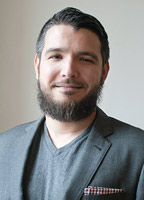
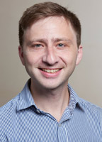
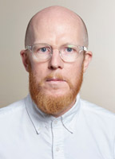

The data science team at the [Arnhold Institute for Global Health](http://icahn.mssm.edu/research/arnhold) is made up of:

### Chief Technology Officer

Chief Technology Officer
Dr. Faghmous is Assistant Professor in Population Health Science and Policy at the Icahn School of Medicine at Mount Sinai.

His work combines algorithmic, statistical, and scientific thinking to accelerate scientific discoveries in big data applications. He is one of the proponents of theory-guided data science in which novel data science methods are combined with a domain’s first principles to make significant and lasting discoveries. His PhD thesis from the University of Minnesota ranked fourth globally in data mining, and is one of the first practical examples of theory-guided data science at the intersection of data mining and global climate change. In 2014, it was awarded the Best Dissertation Award in physical sciences in engineering, the university’s highest distinction for graduate work.

At University of Minnesota, Dr. Faghmous was a National Science Foundation (NSF) Graduate Research Fellow, and prior to that, a National Institutes of Health (NIH) Neuro-Physical-Computational Fellow. He graduated Magna Cum Laude from the City College of New York where he was a Rhodes and Gates Scholar nominee.

### Lead Economist and Assistant Professor

Aaron Baum is an economist at the Arnhold Institute for Global Health and an Assistant Professor at the Icahn School of Medicine. His research applies methods from empirical economics to quantify causal relationships. Aaron integrates impact evaluations and R&D on commercial viability into the Institute’s portfolio of work with a focus on value-based care models and data products.

Aaron collaborates closely with financial, health care, and technology institutions. Since 2009, he has collaborated with the largest microfinance institution in Haiti to evaluate and scale up a network of community health entrepreneurs. He is a founding member of City Health Works, a social enterprise based in Harlem that aims to close the gap between hospitals and communities, where he supports business and technology development. Most recently, he was a Technologist in Residence at Cornell Tech on a team that built small data applications for the health care sector.

Aaron’s academic projects combine data and fieldwork to investigate causal relationships in heath and development economics. USAID (United States Agency for International Development), Grand Challenges Canada, and other foundations have supported his work.

Prior to his doctoral studies, Aaron was an MD/MSc candidate at the University of Pittsburgh School of Medicine in the Clinical Scientist Training Program. Before that, he was a trader on the Nasdaq Stock Exchange.

#### Education
- PhD, Columbia University
- BS, University of Chicago

### Data Scientist

As Senior Data Analyst, Patrick is responsible for collecting, analyzing, understanding, and presenting data within the Arnold Institute for Global Health. Patrick works with the data science team and other members in the Institute to undertake research across a wide variety of topics in public health. He uses a wide variety of statistical tools: from descriptive analysis to deep learning. 

Prior to joining Mount Sinai, Patrick was a Fellow at the Insight Data Science program, where he developed a tool to predict population from satellite images.

Patrick earned his PhD in economics from the Australian National University. His research delved into the design of policy to reduce emissions from deforestation in Indonesia. Upon completion of his PhD, he became a postdoctorate researcher at the Potsdam Institute for Climate Impact Research (PIK). At PIK, he researched environmental, climate, and trade policy.

Patrick was born and raised in Melbourne, Australia, and is currently living in Brooklyn.

#### Education
- PhD, Economics, Australian National University
- BA and Bachelor of Commerce, Philosophy, Germanic Studies, and Economics, University of Melbourne 

### Data Scientist

Emilie Bruzelius is an Analyst at the Arnhold Institute for Global Health, and a doctoral student in Epidemiology at Columbia University. She is interested in the intersection of data science and social epidemiology—leveraging emerging technologies to tackle challenges in population health. 

Emilie’s current work uses high-variety data to explore social and environmental determinants of health across multiple geographical and temporal contexts. Prior to joining the Arnhold Institute, Emilie conducted research and program evaluation at Columbia University, Albert Einstein College of Medicine, and Massachusetts General Hospital.

### Forward-Deployed Engineer

Joseph Scarpa is a forward-deployed engineer at the Arnold Institute for Global Health. His work focuses on leveraging data analytics to inform health system design, identify high-risk and high-need patient subpopulations, and improve population health outcomes. 

Prior to joining the Institute, Joseph was a systems biologist studying topics at the intersection of genomics and neuroscience. His work was supported by the Ruth L. Kirschstein National Research Service Award.

Joseph’s PhD work focused on the genetic and molecular bases of sleep dysfunction and stress susceptibility. He specializes in quantitative modeling of high-dimensional data.

#### Education
- PhD, Neuroscience, Icahn School of Medicine at Mount Sinai
- BA, Neuroscience, University of Virginia

### Software Developer

Matthew is a software developer at the Arnhold Institute for Global Health. He is responsible for both front-end and back-end software development, and works closely with a team of researchers, data scientists, and designers. His interests generally include machine learning, data mining, high-performance computing, concurrency, and parallelism. 

Throughout his studies, Matt has published in a number of top-tier conferences, including the International Conference on Data Mining (ICDM), the AAAI Conference on Artificial Intelligence, and the International Conference on Functional Programming.

#### Education
- BS, Computer Science, University of Minnesota, Twin Cities
- MS, Computer Science, Rochester Institute of Technology